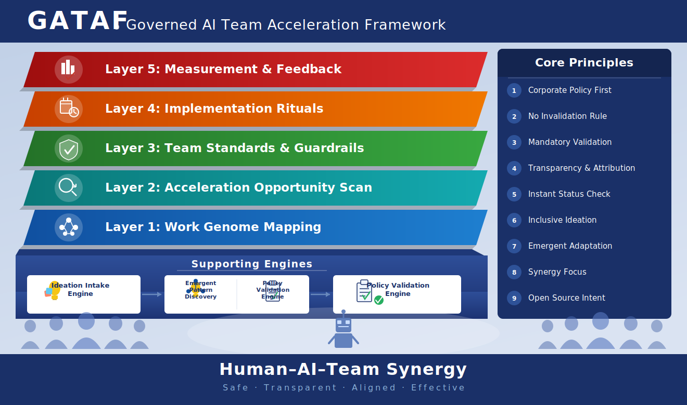

# GATAF — Governed AI Team Acceleration Framework

GATAF (Governed AI Team Acceleration Framework) is an open governance framework designed to help enterprise teams safely integrate AI into their daily workflows by mapping existing work, aligning with corporate policy, and co-creating guardrails that enable transparent human–AI collaboration.

---

## Visual Architecture

---

## Framework Layers

GATAF is structured as five progressive layers, each building on the one below it:

| Layer | Name | Purpose |
|-------|------|---------|
| **Layer 5** | Measurement & Feedback | Track outcomes, measure AI impact, and close the continuous-improvement loop. |
| **Layer 4** | Implementation Rituals | Establish recurring team ceremonies that embed governed AI use into daily work. |
| **Layer 3** | Team Standards & Guardrails | Define team-level policies, review checkpoints, and usage boundaries. |
| **Layer 2** | Acceleration Opportunity Scan | Identify where AI can safely accelerate team workflows with maximum leverage. |
| **Layer 1** | Work Genome Mapping | Capture a structured map of the team's existing tasks, skills, and data flows. |

---

## Supporting Engines

Three engines power the framework's continuous operation:

1. **Ideation Intake Engine** — Collects and structures AI-related ideas from all team members inclusively.
2. **Emergent Pattern Discovery / Policy Validation Engine** — Surfaces recurring patterns from team usage and validates them against corporate policy in real time.
3. **Policy Validation Engine** — Acts as the final compliance gate, ensuring every adopted practice aligns with organizational policy before it is institutionalized.

---

## Core Principles

| # | Principle | Description |
|---|-----------|-------------|
| 1 | **Corporate Policy First** | All AI use must align with existing corporate policy before any other consideration. |
| 2 | **No Invalidation Rule** | AI output never overrides or invalidates human judgment or established process. |
| 3 | **Mandatory Validation** | Every AI-assisted work product requires explicit human validation before use. |
| 4 | **Transparency & Attribution** | AI contributions must be declared and attributed in all outputs. |
| 5 | **Instant Status Check** | Team members can request a real-time assessment of any AI task at any moment. |
| 6 | **Inclusive Ideation** | Every team member — regardless of AI literacy — has an equal voice in shaping AI adoption. |
| 7 | **Emergent Adaptation** | The framework evolves based on observed team patterns rather than top-down mandates. |
| 8 | **Synergy Focus** | Prioritize human–AI combinations that produce outcomes neither could achieve alone. |
| 9 | **Open Source Intent** | All framework artifacts are shared openly to benefit the broader community. |

---

## Human–AI–Team Synergy

GATAF is grounded in the belief that the highest-value outcomes emerge from *Safe · Transparent · Aligned · Effective* collaboration between humans and AI — not from AI acting autonomously or humans avoiding AI entirely.

---

## License

Licensed under the [Apache License 2.0](LICENSE).
